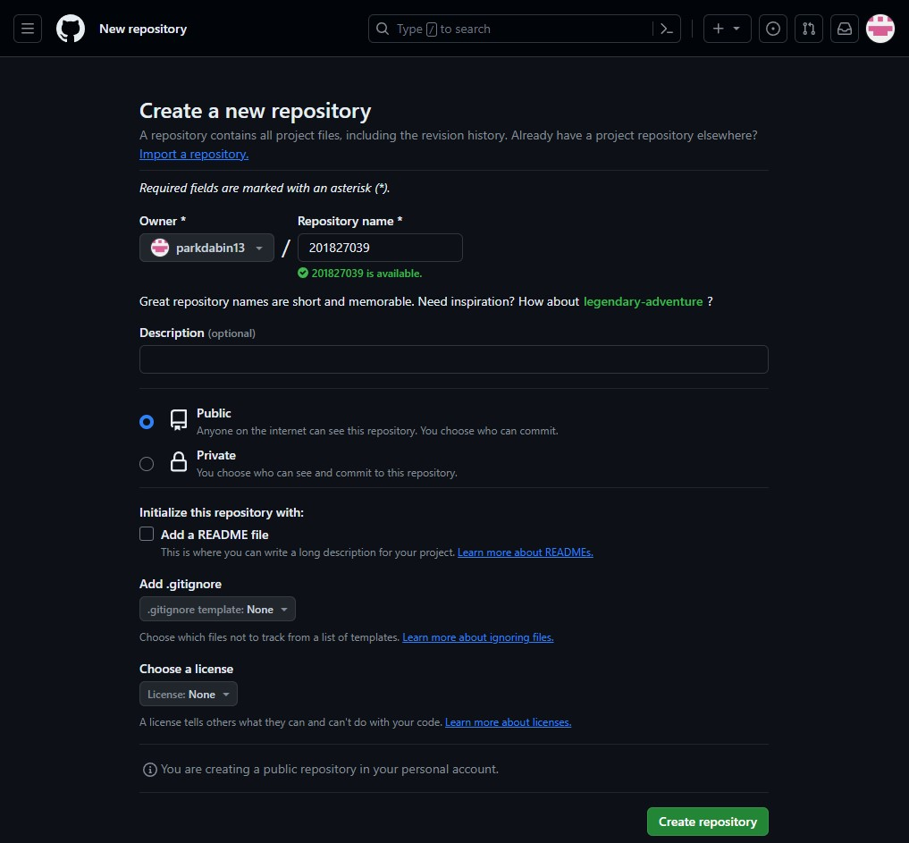

# Git 조사 과제

------------------------------------------------------------------------------------------------------------------

* 이름 : 박다빈

* 학번 : 201827039

* Git 주소 : https://github.com/parkdabin13/201827039.git

* Git commitid : 811c969f46b24fbd00ab89b0158985f42a87235e 

------------------------------------------------------------------------------------------------------------------

# VSC

VSC란?

Version Control System의 약자이며 버전 관리 시스템을 의미합니다.

파일의 변경 사항을 추척하고 관리하는 도구이며 주로 소프트웨어 개발에서 사용됩니다.

# - 주요 특징 -

1. 버전관리

파일의 변경 내역을 시간별로 기록하고 저장할 수 있어 이전 버전으로 복구, 변경 내역 비교 가능 합니다.

2. 협업

여러 명의 개발자가 동시 작업을 할 때 충돌을 방지하고 변경 내역을 효율적으로 관리 할 수 있습니다.
각 개발자는 자신이 변경한 내용을 공유하고 다른 팀원들과 협력 할 수 있습니다.

3. 백업

모든 변경 내역이 중앙 저장소(.1)에 기록되어 데이터를 백업하고 복구 할 수 있습니다.

4. 추적 및 검토

변경 사항을 추척하고 코드 리뷰를 수행할 수 있어 코드 품질을 향상시키고 팀의 생산성이 증가 합니다.

**(.1) 중앙 저장소**

VCS에서 프로젝트의 모든 파일과 해당 파일의 버전 변경 이력이 중앙 위치에 저장되는 곳 입니다.

# DVCS

DVCS란?

Distributed Version Control System의 약자이며 분산 버전 관리 시스템을 의미합니다.
개발자들이 작업을 할 때 중앙 서버에만 의존하는 대신, 각 개발자의 로컬 저장소가 전체 프로젝트의 완전한 사본을
갖고 있으며, 변경 사항을 추적하고 관리하는 시스템 입니다.

# 주요 특징

1. 분산 저장소

각 개발자는 자신의 로컬 환경에 프로젝트의 전체 사본을 가지고 있습니다.
이로써 네트워크 연결이 없는 경우에도 개발 작업을 할 수 있습니다.

2. 협업 및 동기화

각 개발자가 로컬 저장소에서 작업후 변경 사항을 중앙 저장소로 업로드가 가능하여 네트워크 연결이 없는 경우에도
개발 작업을 할 수 있습니다.

3. 분산 작업

각 개발자는 독립적으로 개발이 가능하며, 중앙 서버의 의존성 없이 로컬 저장소에서 작업이 가능합니다.
이를 통해 개발자들의 자유로운 실험과 브랜치를 만들어 다양한 기능을 개발 할 수 있는 장점이 있습니다.

4. 안전한 병합

변경 사항을 통합하는 데 사용되는 다양한 병합 알고리즘(.2)을 제공합니다. 이를 통해 충돌을 방지하고
안전하게 다른 개발자들과 작업을 통합이 가능합니다.

**(.2) 병합 알고리즘**

여러 개의 변경 사항을 하나의 버전으로 통합하는 과정을 자동화하기 위한 알고리즘입니다.

# DVCS와 VCS의 차이점

DVCS와 VCS의 가장 큰 차이점은 중앙 서버의 유무에 있으며, 이는 프로젝트를 협업하며 변경 사항을 추적하고
관리하는 방식에 영향을 미칩니다.

VCS는 중앙 서버에서 모든 작업을 수행하는 반면, DVCS는 각 개발자의 로컬 환경에서 작업하고 변경 사항을 관리합니다.

# 과정 스크린샷 및 명령어 설명

<<<<<<< HEAD

=======

>>>>>>> 65d00ff4607bd1140713b27ee3289eb97a5c836d
여기에 이미지를 꼭 넣어라

# 명령어 설명

cd :

디렉토리를 변경하는 명령어입니다. 현재 작업 중인 디렉토리를 변경하는데 사용됩니다.

mkdir :

디렉토리를 생성하는 명령어입니다. 새로운 디렉토리를 생성할 때 사용됩니다.

git init :

git저장소를 초기화하는 명령어입니다. 현재 디렉토리를 git저장소로 만들 수 있습니다.

git remote add origin <url> :

원격 저장소를 로컬 저장소에 연결하는데 사용됩니다.

touch :

파일을 생성하는 데 사용됩니다. 또한 파일의 최종 수정 시간을 변경하는 용도로도 사용됩니다.
파일의 내용을 변경하지 않고 파일의 최종 수정 시간을 강제로 변경할 수 있게 해줍니다.

git branch -m :

커밋이나 변경 사항에는 영향을 주지 않고 브랜치의 이름을 변경하는 데 사용됩니다.

git add . :

현재 디렉토리와 하위 디렉토리에 있는 모든 변경된 파일을 스테이징 영역에 추가합니다.

git config --global core.autocrlf false :

줄 바꿈 문자를 자동으로 변환하는 방식을 제어합니다. 이곳에서 사용된 false는
자동 줄 바꿈 변환을 비활성화 합니다. 이 설정을 사용하면 줄 바굼을 변경하지 않고
저장소에 있는 파일을 그대로 유지합니다.

git commit -m " " :

변경 사항을 커밋할 때 커밋 메시지를 직접 명령어에 포함하여 작성할 때 사용됩니다.
commit이란 변경 사항을 저장하는 작업이며 각각의 커밋은 변경된 파일의 내용을
포함하고 있으며. 변경 사항을 추척하고 이전 상태로 되돌릴 수 있는 기록을 제공합니다.

git push origin :

로컬 저장소의 변경 사항을 원격 저장소로 업로드 하는 데 사용됩니다.
현재 작업 중인 브랜치의 변경사항을 원격저장소에 업로드합니다 이를 통하여 다른 사용자들이
해당 원격 저장소에 접근하여 최신 변경 사항을 확인하거나 협업 할 수 있습니다.

# .gitignore

gitignore란?

프로젝트 내에서 불 필요하다고 느끼는 특정 파일 및 디렉토리 경로에 대하여 Repository에 업로드 하지 않기 위해
이 파일들을 무시하기 위한 정보를 가지고 있는 파일을 의미합니다.

# 사용법

git init을 실행한 폴더에 touch를 이용해 .gitignore파일을 생성 후 제외할 파일 혹은 폴더를 vim을 이용해 작성합니다.

# 규칙

'#'로 시작하는 라인은 무시합니다

표준 Glop 패턴(.3)을 사용합니다.

슬래시(/)로 시작하면 하위 디렉터리에 적용되지(recursivity) 않습니다.

디렉터리는 슬래시(/)를 끝에 사용하는 것으로 표현합니다.

느낌표(!)로 시작하는 패턴의 파일은 무시하지 않습니다.

**(.3) 표준 표준 Glop 패턴이란?**

정규표현식을 단순화한 것입니다.

- 작성 방식 -

1. 파일/확장자 제외

#파일명.txt

2. 현재 경로에 있는 파일만 제외

/파일명.txt

3. 특정 경로안의 특정 파일 제외

폴더명/파일명.txt

4. 특정 폴더안의 파일 전부 제외

폴더명/

5. 해당 확장자 파일 전체 제외

*.txt

6. 예외

!제외할 파일명.txt

# 내용에 관하여

프로젝트를 진행하다 보면 자동으로 생성되는 로그파일이나 외부 패키지, git에 공유되어서는 안되는 api키와 같은 파일들이 있으니 .gitignore에 업로드 하고 싶지 않은 파일들을 제외하는 내용이 담겨있습니다.

# Mark Down 표기법

Mark Down 표기법이란?

텍스트 기반의 문서를 서식 지정하는 데 사용되는 경량 마크업 언어입니다.
일반 텍스트로 작성되며, 다양한 플랫폼과 도구에서 쉽게 사용할 수 있는 장점이 있습니다. 

# 주요 특징

1. 간결성 : 

간단한 문법을 사용하여 문서를 작성할 수 있습니다.

특수 문자와 텍스트 형식 지정을 사용하여 서식을 표시합니다.

2. 가독성 : 

일반적으로 읽기 쉽고 이해하기 쉽습니다. 

일반 텍스트로 작성되어 있기 때문에 어떤 텍스트 편집기에서도 열고 편집할 수 있습니다.

3. 휴대성 : 

다양한 플랫폼과 도구에서 사용할 수 있습니다. 

HTML, PDF, 워드 문서 등으로 변환이 가능합니다.

4. 지원 : 

다양한 플랫폼에서 지원됩니다.

GitHub, Reddit, Stack Overflow 등에서 사용하여 문서를 작성할 수 있습니다.

# 사용 방법 

1. 헤더 : 

#으로 시작하는 텍스트 입니다 1~6개 까지 사용 가능하며 사용 갯수 마다 제목의 스케일이 낮아집니다.

예) # 고양이는 귀엽다.
     ## 고양이는 귀엽다.
     ### 고양이는 귀엽다.

2. 목록(숫자) : 

숫자를 기입하면 순서가 있는 목록이 됩니다. 들여쓰기를 하면 모양이 바뀌고 어떤 숫자를 쓰냐는 중요치 않고
순서대로 알아서 숫자를 매기면 됩니다.

예)  1. 치킨
     2. 피자
     3. 마라탕
     5. 김치피자탕수육 / 5번을 작성해도 4로 표시됩니다.

3. 순서없는 목록(ex>*) : 

*, +, - 를 이용해서 순서가 없는 목록을 만들 수 있고 들여쓰기를 하면 모양이 바뀝니다.

예) * 엄마
	.* 아빠
	  * 누나

4. 들여쓰기 : 

기본적으로 들여쓰기를 지원하지 않지만 공백 문자인 &/nbsp/; 를 문단의 시작에 기입하면 들여쓰기를 사용할 수 있습니다.

예) /&nbsp/;&/nbsp/;&/nbsp/;수면 시간은 항상 부족하다.

설명을 위해 '/' 사용하여 본문 간섭을 피했습니다.

사용할 때는 '/'를 지우고 사용하세요

5. 코드 블럭 : 

짧은 길이의 간단한 코드는 ~ 기호로 감싸 컬러를 입힐 수 있습니다.

코드가 여러 줄인 경우 , 줄 앞에 공백 네 칸을 추가해서 사용합니다.

~ 뒤에 언어를 지정해주면 syntax color가 적용됩니다.

6. 수평선 :

-, *, _를 3개 이상 작성하면 수평선을 만들 수 있습니다. 

단, -를 사용할 경우 헤더로 인식할 수 있어 이 전 라인은 비워두워야 합니다. 
요
예) ******
     - - - 
     ----------------------

7. 링크 : 

외부 [사이트 이름]/("주소 이름 지정")

예) [Naver]/(https://www.naver.com " 네이버 ")

내부 [링크 이름]/(링크 주소)

예) [1. Headers 헤더]/(#1-headers-헤더)

설명을 위해 '/'사용하여 본문 간섭을 피했습니다.

사용할 때는 '/'를 지우고 사용하세요

8. 이미지 :

앞에 !가 붙습니다.

인라인 이미지 ![alt text]/(/test.png)

링크 이미지 ![alt text]/(image_URL)

이미지의 사이즈를 변경하기 위해서는 <.img width="OOOpx" height="OOOpx"><./img>와 같이 표현합니다.

설명을 위해 '.'을 사용하여 본문 간섭을 피했습니다.

사용할 때는 '.'을 지우고 사용하세요

예) 
![텍스트]/(이미지파일경로.jpg)
![텍스트]/(이미지파일URL)

이미지 파일에 마우스를 올렸을 때 커서 옆에 나오는 텍스트 설정

![텍스트]/(이미지파일경로.jpg "이미지이름") 
![텍스트]/(이미지파일URL "이미지이름")

설명을 위해 '/'사용하여 본문 간섭을 피했습니다.

사용할 때는 '/'을 지우고 사용하세요

9. 강조 : 

기울여 쓰기(italic) : "* 또는 _로 감싼 텍스트."

두껍게 쓰기(bold) : ** 또는 __로 감싼 텍스트.

취소선 : ~~로 감싼 텍스트.

이탤릭체와 두껍게를 같이 사용할 수 있습니다.

예) 

_This will also be italic_

**This will also be bold**

~~This is canceled~~

_You **can** ~~combine~~ them_

감사합니다.

